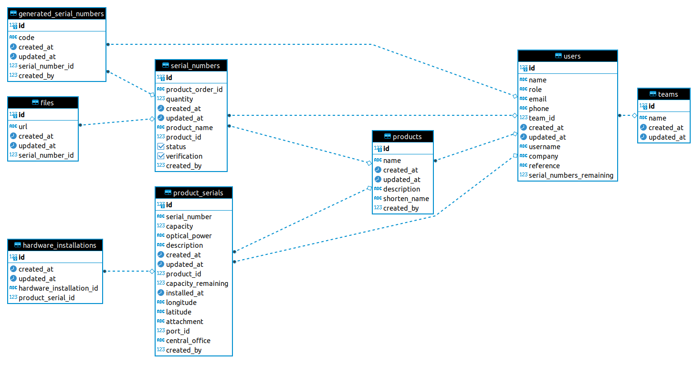

# InventZone Warehouse

This project contains a dashboard application to interact with data for InventZone mobile app and it is also used for handling the main business logic of the entire system.

## Table of Contents

- [InventZone Warehouse](#inventzone-warehouse)
  - [Table of Contents](#table-of-contents)
  - [Getting Started](#getting-started)
    - [Prerequisites](#prerequisites)
    - [Development](#development)
    - [Deployment](#deployment)
  - [Database Schema](#database-schema)

## Getting Started

### Prerequisites

Before running the application, you need to install and configure several tools below.

- [NodeJS](https://nodejs.org/en)
- [SuperTokens](https://supertokens.com/)
- [Docker](https://www.docker.com/)
- [PostgreSQL](https://www.postgresql.org/)
- [Hasura GraphQL Engine](https://hasura.io/docs/latest/getting-started/overview/)

If you do not want to configuring all of them, we also provide Docker Compose file in order to spin up instantly. Run the below command and you are ready to go.

```bash
$ docker compose up -d
```

### Development

In this section we will explain on how to run this project locally or in the development mode. The application needs configuration file in order to runs properly. Duplicate the `.env.example` file to `.env` with this following command

```bash
$ cp .env.example .env
```

then fill up all the mandatory fields inside the `.env` file. Next, open the `backendConfig.ts` file inside the config folder and change this configuration.

```js
supertokens: {
  connectionURI: "http://127.0.0.1:3567",
},
```

After that, you should change the application info that placed into the `config/` folder. Fill up with the following information for development purpose

```js
export const appInfo = {
  appName: "ODN Apps",
  apiDomain: "http://localhost:3000",
  websiteDomain: "http://localhost:3000",
  apiBasePath: "/api/auth",
  websiteBasePath: "/auth",
};
```

Now, you can install and start the development server by using this command

```bash
$ npm install
$ npm run dev
```

then open your browser and access to the `http://127.0.0.1:3000`.

### Deployment

Warehouse application rely on the Docker container to deploy the application into production environment.

## Database Schema

